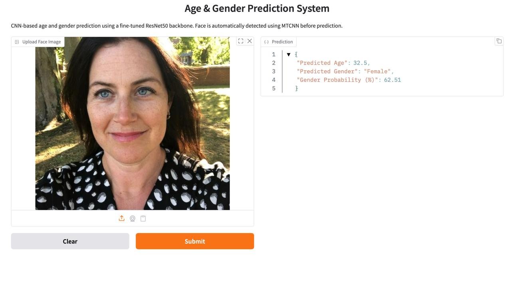

# Age and Gender Predictor Using CNN Functional API

A cleaner, more professional version of an age-and-gender prediction project built around a multitask CNN pipeline, ResNet50 transfer learning, MTCNN face detection, and a Gradio demo app.

## What This Project Does

This repository predicts two things from a face image:

- **Age** as a regression output
- **Gender** as a binary classification output with uncertainty handling

The original work lived mostly inside a notebook. This version keeps that notebook for reference, but also adds a reusable Python package, a training script, a runnable app entrypoint, and a stronger repository structure for demos, submissions, and GitHub presentation.

## Highlights

- Multitask learning with a shared **ResNet50** backbone
- Separate prediction heads for **age** and **gender**
- **MTCNN**-based face detection before inference
- Gradio app for quick local demos
- Reusable package structure instead of notebook-only code
- Configurable dataset and model paths via environment variables
- Configurable training epochs, app host/port, and optional dataset subsampling
- Cleaner repository layout for academic and portfolio use

## Preview



## Repository Structure

```text
AGE-AND-GENDER-PREDICTOR-USING-CNN-FUNCTIONAL-API/
├── age_gender_predictor/
│   ├── __init__.py
│   ├── config.py
│   ├── data.py
│   ├── inference.py
│   ├── model.py
│   └── ui.py
├── scripts/
│   └── train.py
├── app.py
├── Example.jpeg
├── requirements.txt
├── utk-dataset-model.ipynb
└── README.md
```

## Model Architecture

The training pipeline uses a pretrained **ResNet50** backbone with two task-specific heads:

- **Age head**
  - Conv2D
  - BatchNormalization
  - GlobalAveragePooling2D
  - Dense layers with dropout
  - ReLU output for non-negative age prediction

- **Gender head**
  - Conv2D
  - BatchNormalization
  - GlobalAveragePooling2D
  - Dense layers with dropout
  - Sigmoid output for gender probability

## Training Strategy

### Stage 1

- Freeze the full ResNet50 backbone
- Train only the custom heads
- Optimizer: Adam
- Learning rate: `1e-4`

### Stage 2

- Unfreeze the `conv5` block only
- Fine-tune with a smaller learning rate
- Learning rate: `1e-5`
- Early stopping based on validation gender AUC

## Data Assumptions

The project expects the aligned **UTKFace** image files, where each filename starts with:

```text
age_gender_race_...
```

Example:

```text
25_0_2_20170116174525125.jpg
```

By default, training looks for images in:

```text
./data/UTKFace
```

You can override that path with:

```bash
export UTKFACE_DATASET_DIR=/absolute/path/to/UTKFace
```

If you have the UTKFace archive on your Desktop, you can extract it into the default project path with:

```bash
mkdir -p data
unzip "/Users/japmanpreetsingh/Desktop/archive (3).zip" -d data
```

## Run Locally

1. Clone the repository:

```bash
git clone https://github.com/Japmanpreet-ctrl/AGE-AND-GENDER-PREDICTOR-USING-CNN-FUNCTIONAL-API.git
cd AGE-AND-GENDER-PREDICTOR-USING-CNN-FUNCTIONAL-API
```

2. Create and activate a virtual environment:

```bash
python3 -m venv .venv
source .venv/bin/activate
```

3. Install dependencies:

```bash
pip install -r requirements.txt
```

4. Train the model:

```bash
python3 scripts/train.py
```

Useful optional environment variables:

```bash
export AGE_GENDER_DATASET_LIMIT=5000
export AGE_GENDER_TRAIN_HEAD_EPOCHS=3
export AGE_GENDER_TRAIN_FINETUNE_EPOCHS=5
```

If you are offline and cannot download pretrained ResNet weights:

```bash
export AGE_GENDER_BACKBONE_WEIGHTS=none
```

5. Launch the Gradio app:

```bash
python3 app.py
```

If your saved model is in a custom location, set:

```bash
export AGE_GENDER_MODEL_PATH=/absolute/path/to/age_gender_resnet50.keras
```

To change where the local app runs:

```bash
export AGE_GENDER_APP_HOST=127.0.0.1
export AGE_GENDER_APP_PORT=7860
```

## Inference Behavior

At inference time, the app:

1. Accepts an uploaded image
2. Detects the most confident face with **MTCNN**
3. Crops and preprocesses the face
4. Runs the multitask model
5. Returns:
   - predicted age
   - predicted gender
   - gender probability

To avoid overconfident outputs near the decision boundary, the app reports **Uncertain** when gender probability falls between `0.45` and `0.55`.

## Limitations

- Performance depends heavily on image quality and frontal face visibility
- Dataset bias in UTKFace can affect generalization
- Age prediction is inherently noisy, especially for children and older adults
- This project is not suitable for identity verification, hiring, policing, or medical use

## Notebook Status

The original notebook is still included as:

```text
utk-dataset-model.ipynb
```

It remains useful for experimentation and training walkthroughs, while the extracted Python package makes the repo easier to run and maintain.

## Disclaimer

This project is for **educational, learning, and demonstration purposes only**. Predictions may be inaccurate and should not be used in sensitive or decision-critical real-world contexts.
